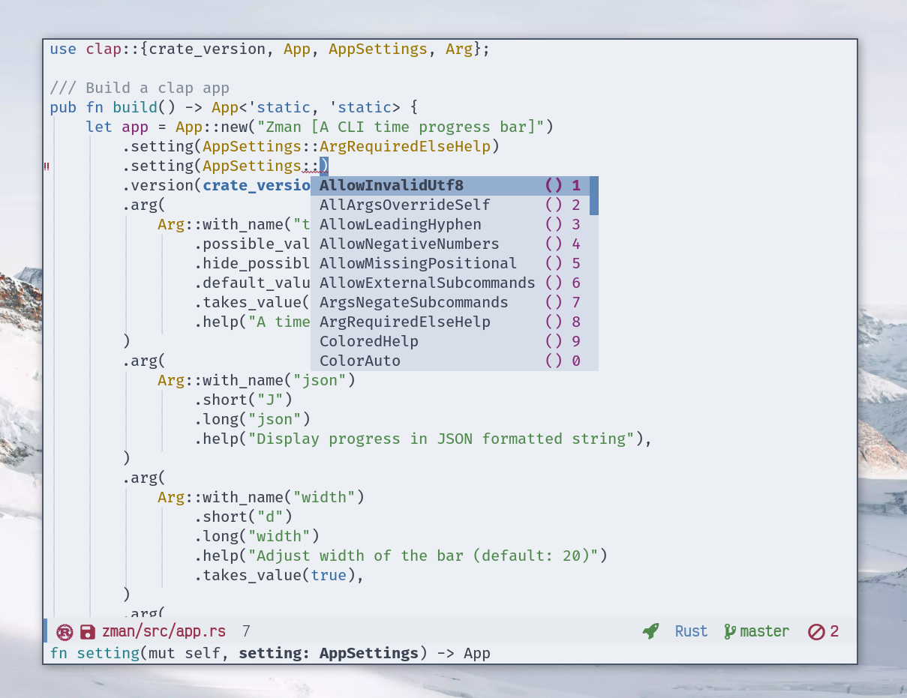

<div align="center">
<h1>.emacs.d</h1>


My personal Emacs 📜 Configuration.

<a href="https://github.com/emacs-mirror/emacs/">
    
</a>

</div>

---

If you're looking for a nice (copy and use) scripts, check out my [useful Emacs Lisp scripts collection](https://azzamsa.com/n/scripts-el/)


<p align="center"></p>
<p align="center"></p>
<p align="center"></p>

## Features

- Most used command reachable under `C-c` and `super`.
- Cryptic command accessible under `hydra` menu.
- Modular configurations. Enable only what you need.
- Versioned package dependencies using `straight.el`.
- Blazing fast startup. Thanks to `use-package defer` and native compilation.
- Litters are keep in the separate directory.
- Separate places for your secrets.
- Sensible dired: omit non-interesting files, colorize by extension.
- Ligature support.
- More...

## Usage

Clone the repository:

``` bash
git clone https://github.com/azzamsa/emacs.d
```

Change the `use-package scripts.el` declaration into `azzamsa/secrets.el-dummy` as shown below.
The secrets are used for some functions such as [Ask Github If I Have New Notification](https://azzamsa.com/n/scripts-el/#ask-github-if-i-have-new-notification).
Separating the secrets this way ensures that my configuration is easy to share without worries.

``` emacs-lisp
(use-package secrets.el
  :straight (scripts.el :type git :host github :repo "azzamsa/secrets.el-dummy")
```

After you have the secrets.el repo locally. Insert your own secrets, then change back the configuration to `:local-repo "secrets.el"`.
So that it loads yours instead of the dummy one.

Now, Run your Emacs! 🚀

## Contribution

I don't plan to accept any contribution that adds new functionality. But it is OK for fixes and improvement.
I don't recommend using this repository directly. Instead, use it as a source of inspiration.

## Credits

Most parts comes from:

- [Bozhidar Batsov](http://batsov.com) - [emacs.d repository](https://github.com/bbatsov/emacs.d) and [Prelude](https://github.com/bbatsov/prelude)
- [Oleh Krehel](https://oremacs.com/) - [oremacs](https://github.com/abo-abo/oremacs)

Other comes from:

[Steve Purcell](https://github.com/purcell/emacs.d), [John Wiegley](https://github.com/jwiegley/dot-emacs),
[Dr Ben Maughan](http://pragmaticemacs.com/), [Xah Lee](http://ergoemacs.org),
[Terencio (rememberYou) Agozzino](https://github.com/rememberYou/.emacs.d),
and [John Kitchin](http://kitchingroup.cheme.cmu.edu/about.html).
I also look to various .emacs.d repositories to take any insight, so the credits also go for them.
