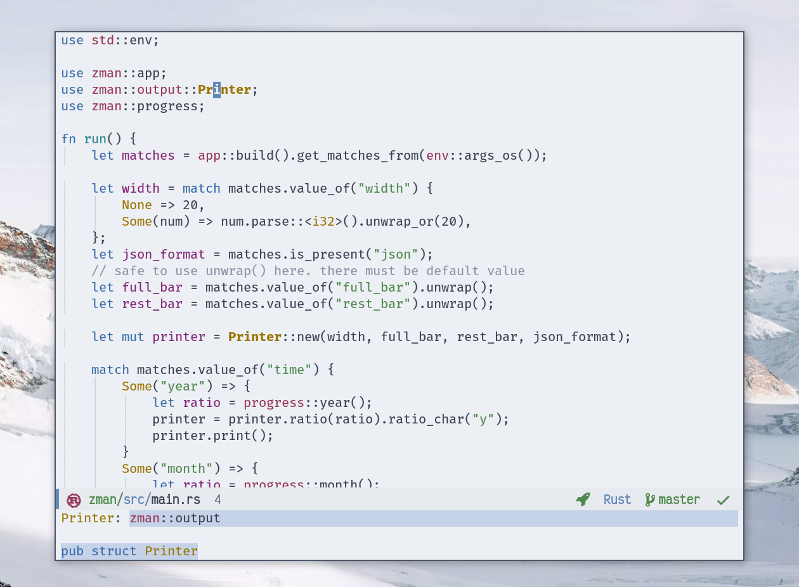

<div align="center">
<h1>.emacs.d</h1>


My personal Emacs 📜 Configuration.

<a href="https://github.com/emacs-mirror/emacs/">
    
</a>

</div>

---

If you're looking for a nice (copy and use) scripts, check out my [useful Emacs Lisp scripts collection](https://azzamsa.com/n/scripts-el/)

<p align="center"></p>
<p align="center"></p>

## Features

- Slim & Fast. Strive to use built-in feature whenever possilbe.
- Most used command reachable under `C-c` and `super`.
- Versioned package dependencies using `straight.el`.
- Blazing fast startup. Thanks to `use-package defer` and native compilation.
- Separate places for your personal configuration.
- Sensible dired: omit non-interesting files, colorize by extension.
- Ligature support.
- More...

## Usage

Clone the repository:

``` bash
git clone https://github.com/azzamsa/emacs.d
```

Now, Run your Emacs! 🚀

## Contribution

I don't plan to accept any contribution that adds new functionality. But it is OK for fixes and improvement.
I don't recommend using this repository directly. Instead, use it as a source of inspiration.

## Notes

This repo only hold currently used config. For old config visit the archive branch.

### Credits

- [Nord Theme](https://www.nordtheme.com/)
